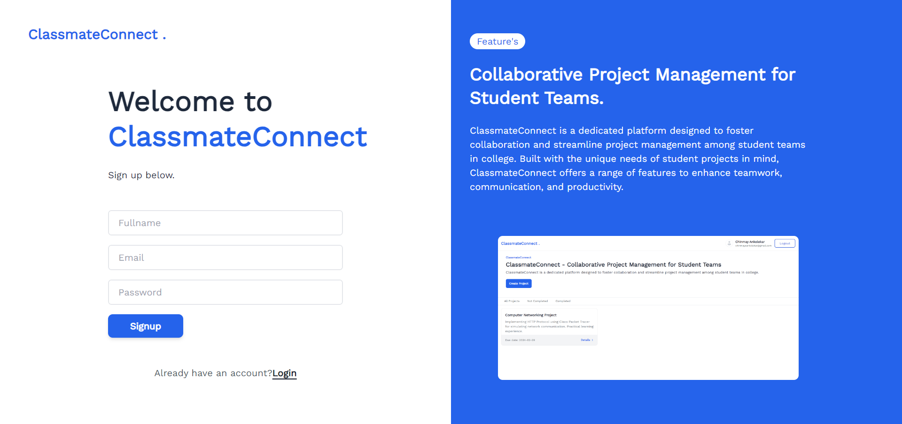
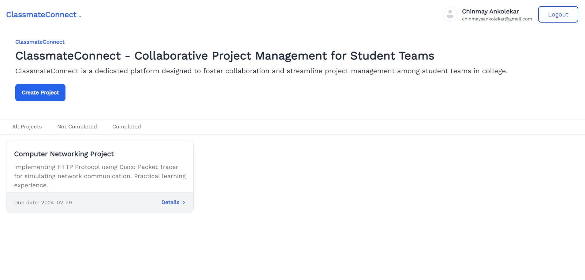

## Classmate Connect

Classmate Connect is a platform designed to facilitate project collaboration and communication among college students. It allows users to create projects, discuss them with teammates, and enhance productivity.

### Features

 1. **Project Creation**:
   Easily create new projects and invite team members.

 2. **Discussion Forum**:
   Collaborate with team members through project-specific discussion forums.

 3. **User Profiles**:
   View profiles of team members to learn more about their skills and contributions.

 4. **Notifications**:
   Stay updated with project activities through real-time notifications.

 5. **Security**:
   Built with security in mind to protect user data and privacy.

### Images 
1. Signup Page
    
    
   
2.Login Page
   
   
   
3. Dashboard
    
    
   
4.Create Project
  
    
   

### Installation
1. Clone the repository: `git clone https://github.com/Chinmay-Ankolekar/ClassmateConnect.git` 
2. Install dependencies: `npm install`
4. Start the development server: `npm run dev`

### Technologies Used
- React.js
- Supabase
