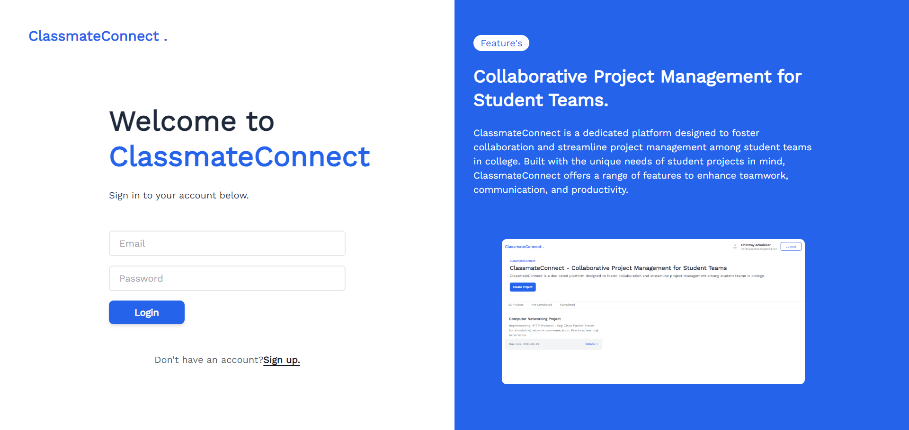

## ClassmateConnect

ClassmateConnect is a platform designed to facilitate project collaboration and communication among college students. It allows users to create projects, discuss them with teammates, and enhance productivity.

### Features

 1. **Project Creation**:
   Easily create new projects and invite team members.

 2. **Discussion Forum**:
   Collaborate with team members through project-specific discussion forums.

 3. **User Profiles**:
   View profiles of team members to learn more about their skills and contributions.

 4. **Security**:
   Built with security in mind to protect user data and privacy.

### Images 
1. Signup Page
    
    
   
2. Login Page
    
    
   
3. Dashboard
    
    
   
4. Create Project
    
    
   
5. Check user while adding member ID's
    
    
   
6. Project Details
    
    
   
7. Project Discussion
    
    
   

### Technologies Used
- React JS
- Supabase Authentication
- Supabase Database 
- Tailwind CSS

### Styling with Tailwind CSS
   
The application's UI is styled using Tailwind CSS.

### Component Library

This project utilizes Component Library Preline, ComponentLand for cards, pages, and other components. 

### Installation
1. Clone the repository: `git clone https://github.com/Chinmay-Ankolekar/ClassmateConnect.git` 
2. Install dependencies: `npm install`
4. Start the development server: `npm run dev`
